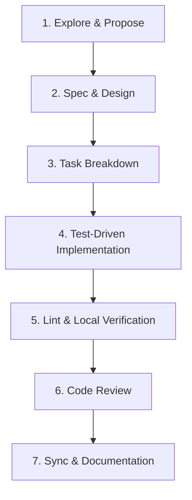

# Feature Development Playbook

This playbook outlines the end-to-end feature development workflow for **KoHarness**. All contributors and AI agents must follow this structured process when proposing, designing, and building new features.

---

## 1. Core Philosophy

- **Spec-Driven Development:** Every feature starts with a clear proposal and spec prior to writing implementation code.
- **Incremental & Atomic Steps:** Work is broken down into small, testable, dependency-aware tasks.
- **High Quality Standards:** Static analysis, unit tests, and Godoc documentation are required for all additions.

---

## 2. End-to-End Development Workflow

### Phase 1: Exploration & Proposal
1. Analyze user needs and technical constraints.
2. Run `/opsx-propose` or `/opsx-explore` to formulate an OpenSpec change proposal.
3. Validate architectural trade-offs, scope boundaries, and cross-harness compatibility (Claude Code, Antigravity, Codex).

### Phase 2: Technical Design & Specification
1. Write or update OpenSpec artifacts (`proposal.md`, `specs/`, `design.md`).
2. Ensure specifications include clear requirement IDs, MUST/SHALL statements, and WHEN/THEN scenarios.
3. Define data models, CLI flags, and Bubbletea TUI component structures.

### Phase 3: Task Breakdown
1. Generate `tasks.md` ordered chronologically by dependency.
2. Group tasks logically (e.g. Domain Models -> Storage/FS -> Adapters -> CLI Routing -> TUI Components -> Tests -> Docs).

### Phase 4: Implementation
1. Develop features iteratively task-by-task using `/opsx-apply`.
2. Write unit tests alongside implementation.
3. Use `afero.Fs` interface for filesystem interactions to maintain testability.
4. Add Godoc documentation for all public packages, types, and functions.

### Phase 5: Linting & Local Verification
1. Run `go test ./...` to verify all test cases pass cleanly.
2. Run `golangci-lint run` to check code formatting, safety, and static analysis.
3. Execute `koharness lint` to validate prompt, skill, and config schemas.

### Phase 6: Code Review
1. Review implementation against [PLAYBOOKS/code-review.md](file:///Users/korakot/dev/koharness/PLAYBOOKS/code-review.md).
2. Verify all acceptance scenarios defined in the OpenSpec change are satisfied.

### Phase 7: Sync & Documentation Update
1. Update user-facing documentation in [README.md](file:///Users/korakot/dev/koharness/README.md) if CLI options or workflows changed.
2. Run `/opsx-sync` and archive completed changes.

---

## 3. Development Guidelines & Best Practices

- **Cross-Platform Compatibility:** Never hardcode path separators (`/` or `\`). Always use `filepath.Join()`.
- **Atomic Operations:** Ensure dotfile backups and symlink creations are atomic or rolled back on failure.
- **User Confirmation:** Commands that modify host configuration files (`init`, `create`, `sync`) must prompt for user approval unless `--yes` / `--force` flag is specified.
